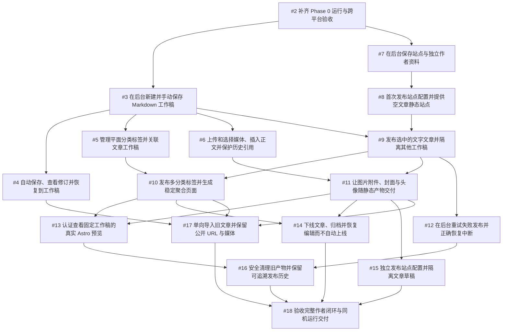

# CMS 首版实施 Tickets

Spec：[CMS 内容管理与同机静态发布首版 #1](https://github.com/EziosWJ/cms-golang-astro/issues/1)

已按用户直接发布授权完成，共 17 张 Tickets，均带 ready-for-agent 标签。阻塞关系写在每个 Issue 的 Blocked by 正文；未创建 GitHub 原生依赖关系。父 Spec 保持原正文与状态。

## 执行顺序

按依赖推进编码。用户于 2026-10-03 明确调整：#2 的环境验收暂时延期，允许先进行业务编码；全部 Ticket 编码完成后统一测试。此调整仅解除 #2 对编码的前置门禁，不将 #2 或任何未执行验收标为通过。源码推送及关闭远端 Issue 仍未授权。

## 当前执行状态（2026-10-04）

#2 为“环境验收延期”，保留 [Issue #2 运行验收及接续记录](../../specs/issue-2-phase-0-validation.md) 的全部真实结果。修复后的远端 CI、Windows/macOS 原生启动与构建仍待执行。依赖表和依赖图保留原验收关系；本次用户授权覆盖 #2 对 #3、#7 编码的阻塞，后续仍遵循业务实现依赖。

#3–#17 已有本地编码实现，包含工作稿/修订、分类媒体/配置、发布与认证预览、生命周期、清理和旧内容导入。编码完成不代表验收通过；已实施 #18 的统一本地验证及运行交付，保留未执行的环境验收，详见 [编码与验收记录](../../specs/phase-1-coding-progress.md) 和 [运行说明](../../specs/phase-1-operations.md)。具体覆盖和未执行项见 [统一验证记录](../../specs/phase-1-validation.md)。完整验收尚未通过的条目保留待验收，不关闭远端 Issue。

## Ticket 依赖

| 序号 | Issue | Blocked by |
| --- | --- | --- |
| 01 | [#2 补齐 Phase 0 运行与跨平台验收](https://github.com/EziosWJ/cms-golang-astro/issues/2) | 无 |
| 02 | [#3 在后台新建并手动保存 Markdown 工作稿](https://github.com/EziosWJ/cms-golang-astro/issues/3) | #2 |
| 03 | [#4 自动保存、查看修订并恢复到工作稿](https://github.com/EziosWJ/cms-golang-astro/issues/4) | #3 |
| 04 | [#5 管理平面分类标签并关联文章工作稿](https://github.com/EziosWJ/cms-golang-astro/issues/5) | #3 |
| 05 | [#6 上传和选择媒体、插入正文并保护历史引用](https://github.com/EziosWJ/cms-golang-astro/issues/6) | #3 |
| 06 | [#7 在后台保存站点与独立作者资料](https://github.com/EziosWJ/cms-golang-astro/issues/7) | #2 |
| 07 | [#8 首次发布站点配置并提供空文章静态站点](https://github.com/EziosWJ/cms-golang-astro/issues/8) | #7 |
| 08 | [#9 发布选中的文字文章并隔离其他工作稿](https://github.com/EziosWJ/cms-golang-astro/issues/9) | #3、#8 |
| 09 | [#10 发布多分类标签并生成稳定聚合页面](https://github.com/EziosWJ/cms-golang-astro/issues/10) | #5、#9 |
| 10 | [#11 让图片附件、封面与头像随静态产物交付](https://github.com/EziosWJ/cms-golang-astro/issues/11) | #6、#9 |
| 11 | [#12 在后台重试失败发布并正确恢复中断](https://github.com/EziosWJ/cms-golang-astro/issues/12) | #9 |
| 12 | [#13 认证查看固定工作稿的真实 Astro 预览](https://github.com/EziosWJ/cms-golang-astro/issues/13) | #10、#11 |
| 13 | [#14 下线文章、归档并恢复编辑而不自动上线](https://github.com/EziosWJ/cms-golang-astro/issues/14) | #10、#11 |
| 14 | [#15 独立发布站点配置并隔离文章草稿](https://github.com/EziosWJ/cms-golang-astro/issues/15) | #11 |
| 15 | [#16 安全清理旧产物并保留可追溯发布历史](https://github.com/EziosWJ/cms-golang-astro/issues/16) | #12、#13 |
| 16 | [#17 单向导入旧文章并保留公开 URL 与媒体](https://github.com/EziosWJ/cms-golang-astro/issues/17) | #4、#10、#11 |
| 17 | [#18 验收完整作者闭环与同机运行交付](https://github.com/EziosWJ/cms-golang-astro/issues/18) | #14、#15、#16、#17 |

## 依赖图

## 拆分说明

任务按作者可操作、读者可观察的纵向行为拆分，不直接照搬原设计的模块级阶段。Phase 0 门禁与最终系统验收为可独立验证的工程任务；其余包含对应数据、服务/API、管理入口、可观察结果及测试。

初始配置发布先验证空站点的完整实际构建/切换；文字文章发布再验证所选文章与其他工作稿隔离。分类和静态媒体分别扩展这条绿色路径。尚未实现的输入应明确拒绝，禁止静默丢失字段或把占位页面当完成。

## 发布检查

- Spec 模板和 51 条用户故事齐备。
- 每张 Ticket 包含父 Spec、行为描述、验收清单和实际阻塞链接。
- 依赖图无环，阻塞项均先发布，去除重复传递边。
- 17 张 Ticket 及 Spec 的 ready-for-agent 标签通过 GitHub 返回结果核实。
- 初始规划发布阶段只发布 Issue 和同步本地文档。后续编码和本地检查已接续完成，结果及待验收项见上方当前执行状态与统一验证记录。
