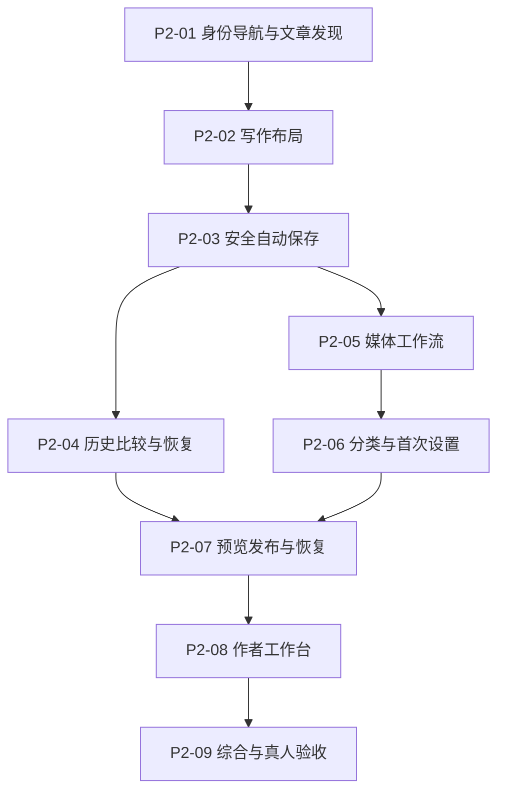

# Phase 2 本地 Tickets

父阶段：[CMS 作者工作流产品化](../../specs/phase-2-productization.md)。行为与验收：[作者工作流 Spec](../../specs/phase-2-author-workflow.md)。

状态：产品方案已确认，已发布 [Phase #20](https://github.com/EziosWJ/cms-golang-astro/issues/20)、[Spec #21](https://github.com/EziosWJ/cms-golang-astro/issues/21) 及 9 张 Tickets（#22–#30），全部开放并带 ready-for-agent 标签；功能编码与本地检查已接入，真人与逐项验收待执行。本目录 P2 编号与远端 Issue 编号对应如下。

## 执行顺序与依赖

| Ticket | GitHub Issue | 交付行为 | 直接前置 |
| --- | --- | --- | --- |
| [P2-01](01-identity-navigation.md) | [#22](https://github.com/EziosWJ/cms-golang-astro/issues/22) | 统一 CMS 身份、导航与文章发现 | 无 |
| [P2-02](02-writing-layout.md) | [#23](https://github.com/EziosWJ/cms-golang-astro/issues/23) | 以正文为中心重组写作界面 | P2-01 |
| [P2-03](03-safe-autosave.md) | [#24](https://github.com/EziosWJ/cms-golang-astro/issues/24) | 新文章自动保存与浏览器恢复保护 | P2-02 |
| [P2-04](04-revision-history.md) | [#25](https://github.com/EziosWJ/cms-golang-astro/issues/25) | 保存版本、比较历史并安全恢复工作稿 | P2-03 |
| [P2-05](05-media-workflow.md) | [#26](https://github.com/EziosWJ/cms-golang-astro/issues/26) | 统一媒体浏览、上传与编辑内插图 | P2-03 |
| [P2-06](06-taxonomy-settings.md) | [#27](https://github.com/EziosWJ/cms-golang-astro/issues/27) | 编辑内组织内容与首次配置发布引导 | P2-05 |
| [P2-07](07-preview-publication.md) | [#28](https://github.com/EziosWJ/cms-golang-astro/issues/28) | 让预览、发布和失败恢复形成完整流程 | P2-04, P2-06 |
| [P2-08](08-author-dashboard.md) | [#29](https://github.com/EziosWJ/cms-golang-astro/issues/29) | 提供真实作者工作台与一致反馈 | P2-07 |
| [P2-09](09-workflow-acceptance.md) | [#30](https://github.com/EziosWJ/cms-golang-astro/issues/30) | 验收完整作者流程与陌生用户独立试用 | P2-08 |

P2-04 与 P2-05 可在 P2-03 后分别推进。表中保留跨页面集成的直接依赖；提前完成局部布局不等于依赖已经满足。

## 实施规则

先核实现有工作树、API/DTO、Page Patterns 和 Phase 1/内置执行器记录；前阶段未验收事项仍由原记录追踪。每张票按作者可观察的行为包含必要前后端工作，不另外创建只有空接口或静态布局的占位票。

- 当前阶段的实际行为以 Spec 为准，既有 DB/身份/发布/引用保护不可静默降级。
- 首次创建与上传响应丢失保护、完整引用查询、工作台真实数据等若现有 API 不支持，在对应票中补齐，不在最终验收时才发现缺口。
- 保持中性专业的现有设计体系；编辑器与媒体布局差异记录在页面覆盖文档，优先复用公共组件。
- 保留未执行与阻塞证据。编码、自动化、浏览器和真人验收分别记账。
- 实施中出现产品行为无法满足或范围调整，明确记录问题与替代方案；不能将“待实现”改成“默认不支持”而跳过约定。

## 验收状态

所有 Acceptance criteria 初始未勾选。实现时增加阶段进度和验证记录链接，记录实际 Taskfile 结果与证据；未执行真人独立试用时，本阶段仍待验收。

本轮已发布 Phase、Spec 与 Tickets，并同步本地编号。父项包含任务索引，子项包含 Parent 与 Blocked by 链接；依赖记录在正文，未设置 GitHub 原生依赖关系。规划发布时未实施业务功能或运行 Check；后续开发与检查见下方记录。未提交或推送源码。

## 开发接续（2026-10-04）

P2-01 至 P2-08 的功能编码已接入，P2-09 的自动化入口和本地证据已整理；见 [开发与验证记录](../../specs/phase-2-validation.md)。编码、自动化、浏览器和真人验收分开记账，原 Acceptance criteria 不批量勾选。真人独立试用及真实设备/跨账号等逐项复核待执行，本阶段保持待验收。未提交、推送或关闭远端 Issues。
